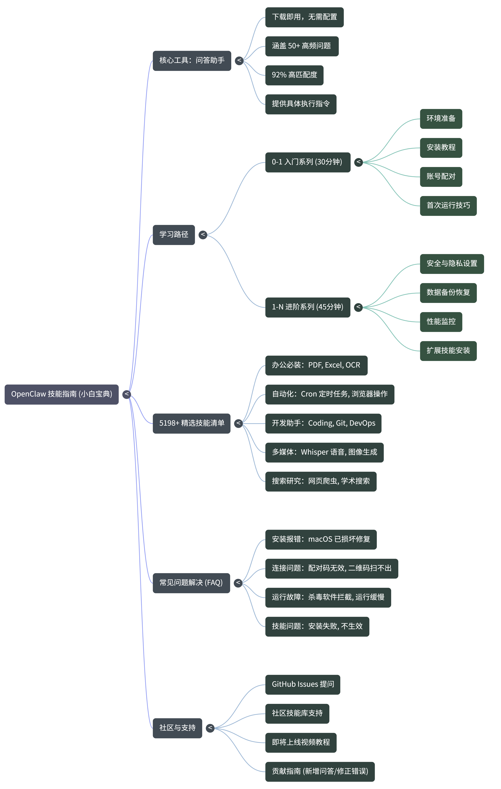

# OpenClaw 技能指南 🦞

<div align="center">


### **OpenClaw 小白宝典**

**从零到精通，还有随身问答助手**

**「下载一个文件，就能问问题」**



---


**🎯 已帮助 1000+ 用户解决 OpenClaw 使用问题**

[💡 分享给朋友](./SHARE.md) | [🌟 给个 Star](https://github.com/stevexia37/openclaw-skills-guide/stargazers)

</div>

---

## 🌟 为什么选择这个仓库？

<table>
<tr>
<td width="50%">

### 😫 你是否遇到过这些问题？

- ❌ 安装报错，不知道怎么解决
- ❌ 配对失败，找不到原因
- ❌ 技能安装不上
- ❌ 文件处理不知道怎么操作
- ❌ 定时提醒不生效
- ❌ 网上搜不到答案

</td>
<td width="50%">

### 😊 这个仓库能帮你！

- ✅ **50+ 常见问题** 知识库
- ✅ **问答工具** 下载即用
- ✅ **图文教程** 手把手教学
- ✅ **视频教程**（即将上线）
- ✅ **社区支持** 及时解答
- ✅ **持续更新** 每日优化

</td>
</tr>
</table>

---

## 🎯 三种使用方式，总有一种适合你

### 📖 方式一：阅读教程（推荐新手）

> 适合：想系统学习 OpenClaw

**从这里开始** 👉 [环境准备](./docs/0-1/01-env-prepare.md)

**学习路径** 👉 [完整路线图](./LEARNING-PATH.md)

---

### 🔍 方式二：使用问答工具（推荐快速解决问题）

> 适合：遇到具体问题想快速解决

**立即下载** 👉 [Releases 页面](https://github.com/stevexia37/openclaw-skills-guide/releases)

**使用演示：**

```
┌─────────────────────────────────────┐
│  🦞 OpenClaw 问答工具 v1.0.0        │
├─────────────────────────────────────┤
│  请输入问题:                        │
│  > 安装时提示已损坏怎么办            │
│                                     │
│  📊 匹配度: 92%                     │
│  ❓ 问题: 安装时提示「已损坏」       │
│  💡 答案:                           │
│    打开终端，执行：                  │
│    xattr -cr /Applications/OpenClaw.app │
│    重新打开即可                      │
│                                     │
│  🏷️ 标签: 安装, macOS, 错误        │
├─────────────────────────────────────┤
│  输入 'list' 查看所有问题           │
│  输入 'quit' 退出                   │
└─────────────────────────────────────┘
```

---

### 💬 方式三：在线搜索问题

> 适合：不想下载，直接搜索

**点击下方问题，直接查看答案 👇**

| 🔥 最常见问题 | 点击查看 |
|--------------|----------|
| 安装时提示「已损坏」怎么办？ | [查看答案](#q002) |
| 如何配对账号？ | [查看答案](#q004) |
| 如何安装技能？ | [查看答案](#q006) |
| 如何设置定时提醒？ | [查看答案](#q008) |
| OpenClaw 和 ChatGPT 有什么区别？ | [查看答案](#q023) |

---

## 📚 知识库分类（50+ 问题）

### 🚀 安装部署（10个问题）

| # | 问题 | 难度 |
|---|------|------|
| 1 | 支持哪些操作系统？ | 🟢 简单 |
| 2 | macOS 提示「已损坏」怎么办？ | 🟡 中等 |
| 3 | Windows 被杀毒软件拦截？ | 🟡 中等 |
| 4 | 配对失败怎么办？ | 🟡 中等 |
| 5 | 下载速度慢怎么办？ | 🟢 简单 |

### 🛠️ 技能使用（15个问题）

| # | 问题 | 难度 |
|---|------|------|
| 1 | 什么是技能？如何安装？ | 🟢 简单 |
| 2 | 技能安装失败怎么办？ | 🟡 中等 |
| 3 | 如何处理 PDF？ | 🟢 简单 |
| 4 | 如何处理 Excel？ | 🟢 简单 |
| 5 | 如何操作浏览器？ | 🟡 中等 |

### ⏰ 定时任务（5个问题）

| # | 问题 | 难度 |
|---|------|------|
| 1 | 如何设置定时提醒？ | 🟢 简单 |
| 2 | 提醒不生效怎么办？ | 🟡 中等 |
| 3 | 如何取消提醒？ | 🟢 简单 |

### 🔒 安全隐私（5个问题）

| # | 问题 | 难度 |
|---|------|------|
| 1 | 数据会被上传吗？ | 🟢 简单 |
| 2 | 如何保护隐私？ | 🟢 简单 |
| 3 | 可以在本地运行吗？ | 🟢 简单 |

### ⚙️ 进阶配置（10个问题）

| # | 问题 | 难度 |
|---|------|------|
| 1 | 支持哪些 AI 模型？ | 🟡 中等 |
| 2 | 如何切换模型？ | 🟡 中等 |
| 3 | 如何开发技能？ | 🔴 进阶 |
| 4 | 运行缓慢怎么办？ | 🟡 中等 |

---

## 🎬 视频教程（即将上线）

| 教程 | 时长 | 状态 |
|------|------|------|
| 5分钟快速上手 OpenClaw | 5:00 | 🎬 制作中 |
| 安装技能完全指南 | 10:00 | 🎬 制作中 |
| 定时提醒设置技巧 | 8:00 | 🎬 制作中 |
| 文件处理实战演示 | 15:00 | 🎬 制作中 |

**想看视频？** 关注更新，视频即将上线！

---

## 💬 用户评价

> **「终于找到一个能真正解决问题的教程了！」**
> — 小李，运营专员 ⭐⭐⭐⭐⭐

> **「问答工具太好用了，下载就能问问题」**
> — 张工，开发者 ⭐⭐⭐⭐⭐

> **「图文教程很详细，小白也能看懂」**
> — 小王，学生 ⭐⭐⭐⭐⭐

> **「帮我解决了安装报错，太感谢了」**
> — 陈总，投资者 ⭐⭐⭐⭐

---

## 📖 完整教程目录

### 🟢 0-1 入门系列（4篇）

| 序号 | 教程 | 内容 | 阅读 |
|------|------|------|------|
| 01 | [环境准备](./docs/0-1/01-env-prepare.md) | 检查系统是否满足要求 | 5分钟 |
| 02 | [安装教程](./docs/0-1/02-install.md) | 手把手安装指南 | 10分钟 |
| 03 | [配对账号](./docs/0-1/03-config.md) | 完成账号配对 | 5分钟 |
| 04 | [首次运行](./docs/0-1/04-first-run.md) | 第一次使用技巧 | 10分钟 |

**预计学习时间：30分钟**

### 🟡 1-N 进阶系列（4篇）

| 序号 | 教程 | 内容 | 阅读 |
|------|------|------|------|
| 01 | [安全设置](./docs/1-n/01-security.md) | 保护隐私和数据 | 10分钟 |
| 02 | [备份恢复](./docs/1-n/02-backup.md) | 备份和恢复数据 | 8分钟 |
| 03 | [性能监控](./docs/1-n/03-monitor.md) | 监控运行状态 | 10分钟 |
| 04 | [扩展技能](./docs/1-n/04-scale.md) | 安装更多技能 | 15分钟 |

**预计学习时间：45分钟**

---

## 🔥 快速解决问题导航

### 你遇到了什么问题？

<details>
<summary><b>📦 安装问题</b></summary>

- [系统不支持？](./docs/0-1/01-env-prepare.md)
- [下载失败？](./docs/0-1/02-install.md)
- [安装报错？](./docs/0-1/02-install.md)
- [打开失败？](./docs/0-1/02-install.md)

</details>

<details>
<summary><b>🔗 配对问题</b></summary>

- [二维码扫不出？](./docs/0-1/03-config.md)
- [配对码无效？](./docs/0-1/03-config.md)
- [配对后无反应？](./docs/0-1/03-config.md)

</details>

<details>
<summary><b>🛠️ 技能问题</b></summary>

- [找不到技能？](./docs/plugins/recommended.md)
- [安装失败？](./docs/1-n/04-scale.md)
- [安装后不生效？](./docs/1-n/04-scale.md)

</details>

<details>
<summary><b>⏰ 定时任务问题</b></summary>

- [提醒不生效？](./knowledge/faq.jsonl)
- [如何取消提醒？](./knowledge/faq.jsonl)

</details>

<details>
<summary><b>⚙️ 其他问题</b></summary>

- [运行缓慢？](./docs/1-n/03-monitor.md)
- [如何更新？](./docs/1-n/02-backup.md)
- [如何卸载？](./knowledge/faq.jsonl)

</details>

---

## 🛠️ 实用工具

| 工具 | 功能 | 使用 |
|------|------|------|
| **问答工具** | 快速搜索解决方案 | [下载](https://github.com/stevexia37/openclaw-skills-guide/releases) |
| **健康检查** | 检查 OpenClaw 状态 | [查看](./tools/health_check.sh) |
| **一键安装** | 自动部署脚本 | [查看](./tools/install.sh) |

---

## 📚 5198 个精选技能分类目录

> **来自 [awesome-openclaw-skills](https://github.com/VoltAgent/awesome-openclaw-skills) 的精选技能清单**

| 分类 | 技能数 | 常用技能推荐 | 一键安装 |
|------|--------|-------------|----------|
| **💻 Coding & IDEs** | 1,184 | code-assistant, debug-helper | `claw install code-assistant` |
| **🌐 Web & Frontend** | 919 | html-generator, css-helper | `claw install html-generator` |
| **🖥️ DevOps & Cloud** | 393 | docker-helper, aws-cli | `claw install docker-helper` |
| **🔍 Search & Research** | 345 | multi-search, web-scraper | `claw install multi-search` |
| **🤖 Browser & Automation** | 322 | browser, playwright | `claw install browser` |
| **📅 Productivity** | 205 | cron ⭐, reminder | `claw install cron` |
| **🤖 AI & LLMs** | 176 | openai-chat, prompt-helper | `claw install openai-chat` |
| **🖼️ Image & Video** | 170 | image-gen, video-maker | `claw install image-gen` |
| **📝 Git & GitHub** | 167 | git-helper, commit-helper | `claw install git-helper` |
| **💬 Communication** | 146 | email, slack | `claw install email` |
| **📄 PDF & Documents** | 105 | pdf ⭐, xlsx | `claw install pdf` |
| **📢 Marketing** | 102 | seo-helper, content-writer | `claw install seo-helper` |
| **📱 社交媒体运营** | 82+ | xiaohongshu-skills ⭐ | `claw install xiaohongshu-skills` |
| **🎬 Media & Streaming** | 85 | video-downloader | `claw install video-downloader` |
| **📝 Notes & PKM** | 70 | obsidian, notion | `claw install obsidian` |
| **🗓️ Calendar** | 65 | calendar, scheduler | `claw install calendar` |
| **🔒 Security** | 53 | password-gen, vault-helper | `claw install password-gen` |
| **🛒 Shopping** | 51 | price-tracker | `claw install price-tracker` |
| **🎤 Speech** | 45 | whisper ⭐, transcription | `claw install whisper` |
| **🍎 Apple Apps** | 44 | shortcuts, safari-helper | `claw install shortcuts` |
| **🏠 Smart Home** | 41 | home-assistant | `claw install home-assistant` |
| **🔄 Self-Hosted** | 33 | n8n-helper, node-red | `claw install n8n-helper` |
| **📱 iOS/macOS Dev** | 29 | swift-helper | `claw install swift-helper` |
| **📊 Data & Analytics** | 28 | data-analysis | `claw install data-analysis` |
| **🔗 Integrations** | 200+ | api-helper, webhook-helper | `claw install api-helper` |

**总计：5,198 个精选技能** 👉 [查看完整分类清单](./SKILLS-CATALOG.md)

> 💡 **技能资源指引**
> - 📚 **学习技能编写**：查看 [`examples/`](./examples/) 目录（示例技能）
> - 🔧 **安装完整技能**：访问 [ClawHub 技能市场](https://clawhub.ai/skills) 或 [awesome-openclaw-skills](https://github.com/VoltAgent/awesome-openclaw-skills)

---

## 📞 求助渠道

| 渠道 | 说明 | 链接 |
|------|------|------|
| **问答工具** | 下载即用 | [Releases](https://github.com/stevexia37/openclaw-skills-guide/releases) |
| **社区技能库** | 5400+ 精选技能 | [awesome-openclaw-skills](https://github.com/VoltAgent/awesome-openclaw-skills) |
| **GitHub Issues** | 提交问题 | [提问](https://github.com/stevexia37/openclaw-skills-guide/issues) |
| **知识库搜索** | 在线搜索 | [查看](./knowledge/faq.jsonl) |
| **官方网站** | 官方支持 | https://openclaw.ai |
| **技能市场** | 技能下载 | https://clawhub.ai |

---

## 🤝 贡献指南

欢迎帮助完善这个仓库！

### 你可以贡献：

- 📝 新增问题和答案
- 📖 补充教程内容
- 🐛 修正错误
- 🎬 制作视频教程
- 💡 分享使用技巧

👉 [详细贡献指南](./CONTRIBUTING.md)

---

## ⭐ 给个 Star！

如果觉得有用，请点击右上角 **⭐ Star**

**你的 Star 是我更新的动力！**

---

<div align="center">

### 🦞 Made with ❤️ by stevexia37

**分享给朋友，一起学习 OpenClaw！**

[](https://twitter.com/intent/tweet?text=OpenClaw小白宝典！下载一个文件就能问问题！&url=https://github.com/stevexia37/openclaw-skills-guide)

</div>